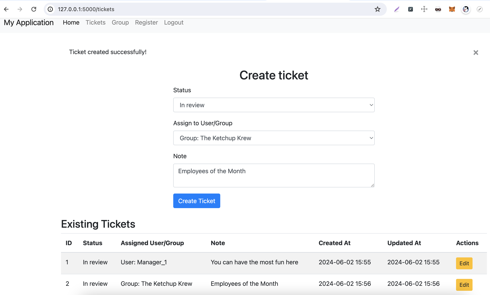

# Flask Ticket System

## Project Description

This project implements a simple ticket management system using Flask. It supports different user roles and groups, and has a simple authentication mechanism.

### Features

- **Tickets**: Have status (Pending, In review, Closed), assignment to user or group, and a note.
- **Users**: Managed by Role-Based Access Control (RBAC).
  - **Admin**: Can manage all groups and tickets.
  - **Manager**: Can manage tickets assigned to groups.
  - **Analyst**: Can manage tickets assigned to users.


### Superuser

The application comes with a pre-configured superuser:
- **Username**: admin
- **Password**: admin

## Build and Run Commands

### Using Docker

1. **Build Docker Image**:
    ```sh
    docker build -t flask-ticket-system .
    ```

2. **Run Docker Container**:
    ```sh
    docker run -p 5000:5000 flask-ticket-system
    ```


### Manual Installation

1. **Clone the repository**:
    ```sh
    git clone https://github.com/Madaocv/flask-ticket-system-eliiashiv.git
    cd flask-ticket-system
    ```

2. **Create and activate a virtual environment**:
    ```sh
    virtualenv -p python3 venv
    source venv/bin/activate  # for macOS/Linux
    venv\Scripts\activate  # for Windows
    ```

3. **Install dependencies**:
    ```sh
    pip install -r requirements.txt
    ```

4. **Initialize the database and create the admin user**:
    ```sh
    flask db init
    flask db migrate -m "Initial migration"
    flask db upgrade
    flask create_admin
    ```

5. **Run the application**:
    ```sh
    flask run
    ```

## Screenshot Examples

### Home Page


*Home Page*

### Create Ticket Page


*Create Ticket Page*

### Create Group Page


*Create Group Pagee*


